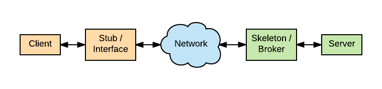

Architecture
============

POP-Java's general architecture is not fundamentally different from alternatives like RMI, see :num:`poprmi`.
Like in RMI, POP's Interface act like RMI's Stub, while POP's Broker act like RMI's Skeleton, but the similarities end
there.

.. _poprmi:

    POP-Java RMI similarity

The similarities end on the way object communicate with each other, since RMI require that object are registered on
an RMI Server while every POP Object is independent and is a server on its own.
We also need to write a single class with POP-Java while we need multiple for RMI.

.. todo:: more details? components diagram (which though)?