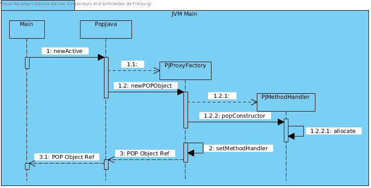
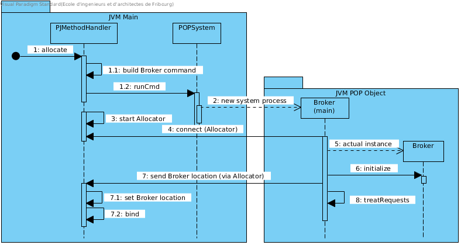

Architecture
============

POP-Java's general architecture is not fundamentally different from alternatives like RMI, see :num:`poprmi`.
Like in RMI, POP's Interface act like RMI's Stub, while POP's Broker act like RMI's Skeleton, but the similarities end there.

.. _poprmi:
.. figure:: ../images/pop-rmi.png

    POP-Java RMI similarity

The similarities end on the way object communicate with each other, since RMI require that object are registered on an RMI Server while every POP Object is independent and is a server on its own.
We also need to write a single class with POP-Java while we need multiple for RMI.

Object Creation
---------------

The creation of a new POP Object always start in the same manner, via a call to ``PopJava.newActive(...)``.
This will call Javassist to wrap the ``@POPClass`` annotated class into a ``POPObject``, creating a fictitious class used as a proxy to the actual instantiated remote object. See :num:`pop-object-creation` to understand how the fictitious class is created.

.. _pop-object-creation:

    Creation of Proxy class with Javaassist

The allocate method in :num:`pop-object-creation` will handle the creation of a new JVM and the connection to the remote object. This happen transparently without the user intervention or knowledge.

:num:`broker-allocation` shows a simplified version of how a new JVM is spawned and the connection between ``PJMethodHandler`` and ``Broker`` is established.

.. _broker-allocation:

    PJMethodHandler (Interface) spawn a connect to a new JVM

``bind``, at the end, connect ``PJMethodHandler`` and the ``Broker`` instance directly so they can communicate.
``treatRequests`` is a loop designed to handle all method calls toward an object.
