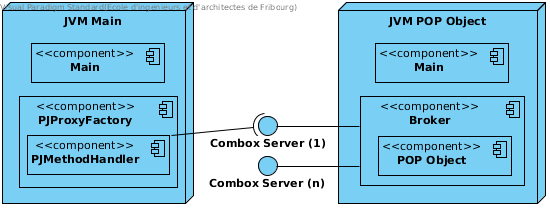

Broker & Interface
==================

The Broker and Interface are the two fundamental blocks of POP-Java, the former represent the server instance of a POP Object while the latter is the client connecting to it.

Broker
------

The ``Broker`` class is a wrapper for an instance of a POP Object. Meaning that each instantiated POP Object will have its own Broker instance associated with it. It is also the entry point for newly created POP Objects.

General architecture
~~~~~~~~~~~~~~~~~~~~

As we can see in :num:`broker-components` we have two distinct JVMs, one running the Main of the application while the second running the Broker's Main.

The Broker's Main will create a new ``Broker`` instance which will be the wrapper for the POP Object requested by the application Main. The instance will open one or more listening ``ComboxServer`` which will enable ``Broker`` to receive method calls from ``PJMethodHandler`` and send them to the wrapped object. See :doc:`architecture` to understand how POP Objects are created.

.. _broker-components:

    Broker components

.. note:: ``PJMethodHandler`` extends ``Interface``, which is the base of communication with a ``Broker``; without ``PJMethodHandler`` is what enable us to make remote calls to methods.

Entry Point
~~~~~~~~~~~

A ``Broker`` can be create in two ways: as the entry point (main) of a new JVM (:num:`broker-components`) or directly by ``PJProxyFactory`` if we decide *not* to create a new dedicated JVM.

Let's take a look at an example of the former case in a classic scenario, the arguments received by the ``Broker`` main are: ::

     -object=MyPopObject
     -codelocation=http://myapp.com/app.jar
     -callback=socket://IP:PORT1
     -appservice=socket://IP:PORT2 ssl://IP:PORT3
     -socket_port=0
     -ssl_port=0

* ``object`` is the name of the class of our POP Object.
* ``codelocation`` tell the Broker where to load ``object`` from.
* ``callback`` is an immediate location to report which ``ComboxServer`` ``Broker`` has opened.
* ``appservice`` the location where ``AppService`` can be accessed from.
* ``<PROTOCOL>_port`` open a ``ComboxServer`` of type ``PROTOCOL``.

If the user is using a personal POP-Java configuration file and used ``@POPObjectDescription(url = "localhost")`` a extra parameter ``configfile`` is added with the path to the file which will be loaded by the ``Broker``.

Initialization
~~~~~~~~~~~~~~

In both `Entry Point`s the method ``public boolean initialize(java.util.List<java.lang.String>);`` is called, the main objective of this method is to start ``ComboxServer`` in relation to how many ``<PROTOCOL>_port`` were supplied.

In the case no particular protocol was supplied, the default one specified in :ref:`DEFAULT_PROTOCOL <DEFAULT_PROTOCOL>` will be used.

.. note:: It's possible to open multiple ``ComboxServer`` of the same type by supplying ``<PROTOCOL>_port`` multiple times.

Interface & PJMethodHandler
---------------------------

``Interface`` is the class we use to allocate a new JVM and connect to a new POP Object; ``PJMethodHandler``, instead, by extending it, add the ability to invoke the POP Object methods.

Generally ``Interface`` enable us only to connect to a POP Object, while ``PJMethodHandler`` allow us to use it.

.. note:: Currently ``Interface`` contains multiple static methods used to run a command on the local machine and lauch a new JVM. Those methods, name-wise and location-wise, are confusing and should be moved.

