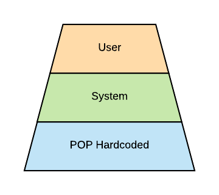

.. _dev-configuration:
Configuration
=============

POP-Java can be configured by placing a file in a specific location: ``${POPJAVA_LOCATION}/etc/popjava.properties``.

There exists three level of configuration in POP-Java, the first level is POP Hardcoded values, the second is system level override in the location specified above, while the third level is user level override which enable the user to tweak POP even more locally. This can be seen in :num:`popconf`.

.. _popconf:

    POP-Java Configuration Layers

.. note:: For testing purpose the path ``./etc/popjava.properties`` is also valid.

Parameters available
--------------------

.. _SYSTEM_JOBMANAGER_CONFIG:
.. data:: SYSTEM_JOBMANAGER_CONFIG : File

    ``$POPJAVA_LOCATION/etc/jobmgr.conf`` with ``$POPJAVA_LOCATION`` falling back to ``./`` if not set.
    The location where the Job Manager configuration file located.

.. _DEBUG:
.. data:: DEBUG : Booelan

    ``false`` print debug information to console.

.. _DEBUG_COMBOBOX:
.. data:: DEBUG_COMBOBOX : Booelan

    ``false`` print Combox debug information to console.

.. _RESERVE_TIMEOUT:
.. data:: RESERVE_TIMEOUT : Int

    ``60000`` milliseconds before the Job Manager free reserved registered resources.

.. _ALLOC_TIMEOUT:
.. data:: ALLOC_TIMEOUT : Int

    ``30000`` milliseconds waiting for a connection to happen after a reservation.

.. _CONNECTION_TIMEOUT:
.. data:: CONNECTION_TIMEOUT : Int

    ``30000`` milliseconds waiting before a connection exception is thrown.

.. _JOBMANAGER_UPDATE_INTERVAL:
.. data:: JOBMANAGER_UPDATE_INTERVAL : Int

    ``10000`` milliseconds waiting from interval to interval to check to free resources.

.. _JOBMANAGER_SELF_REGISTER_INTERVAL:
.. data:: JOBMANAGER_SELF_REGISTER_INTERVAL : Int

    ``43200000`` milliseconds (1/2 day) when the Job Manager register itself on its neighbors.

.. _JOBMANAGER_DEFAULT_CONNECTOR:
.. data:: JOBMANAGER_DEFAULT_CONNECTOR : String

    ``jobmanager`` which connector is used when none is specified.

.. _JOBMANAGER_PROTOCOLS:
.. data:: JOBMANAGER_PROTOCOLS : String[]

    ``[ "socket" ]`` protocols which are used for the Job Manager.

.. _JOBMANAGER_PORTS:
.. data:: JOBMANAGER_PORTS : Int[]

    ``[ 2711 ]`` ports which are used in combination with :ref:`JOBMANAGER_PROTOCOLS <JOBMANAGER_PROTOCOLS>`.

.. _JOBMANAGER_EXECUTION_BASE_DIRECTORY:
.. data:: JOBMANAGER_EXECUTION_BASE_DIRECTORY : File

    ``.`` which directory should Job Manager use to start objects.

.. _JOBMANAGER_EXECUTION_USER:
.. data:: JOBMANAGER_EXECUTION_USER : String

    ``null`` with which user should the Job Manager start objects as.

.. _POP_JAVA_DEAMON_PORT:
.. data:: POP_JAVA_DEAMON_PORT : Int

    ``43424`` the default port that the Java Daemon should use.

.. _SEARCH_NODE_UNLOCK_TIMEOUT:
.. data:: SEARCH_NODE_UNLOCK_TIMEOUT : Int

    ``10000`` default time before unlocking the semaphore if no result was received.

.. _SEARCH_NODE_SEARCH_TIMEOUT:
.. data:: SEARCH_NODE_SEARCH_TIMEOUT : Int

    ``0`` default timeout for a Search Node research. ``0`` means that the first node responding will be used.

.. _SEARCH_NODE_MAX_REQUESTS:
.. data:: SEARCH_NODE_MAX_REQUESTS : Int

    ``Integer.MAX_VALUE`` how many nodes should we visit before stopping. Unlimited by default.

.. _SEARCH_NODE_EXPLORATION_QUEUE_SIZE:
.. data:: SEARCH_NODE_EXPLORATION_QUEUE_SIZE : Int

    ``300`` how many nodes should we remember before dropping them to save memory.

.. _TFC_SEARCH_TIMEOUT:
.. data:: TFC_SEARCH_TIMEOUT : Int

    ``5000`` minimum time to wait for TFC results are returned to the user. Similar to :ref:`SEARCH_NODE_SEARCH_TIMEOUT <SEARCH_NODE_SEARCH_TIMEOUT>`.

.. _DEFAULT_ENCODING:
.. data:: DEFAULT_ENCODING : String

    ``xdr``

.. _SELECTED_ENCODING:
.. data:: SELECTED_ENCODING : String

    ``raw``

.. _DEFAULT_PROTOCOL:
.. data:: DEFAULT_PROTOCOL : String

    ``socket`` which protocol should we use when none is specified.

.. _PROTOCOLS_WHITELIST:
.. data:: PROTOCOLS_WHITELIST : Set<String>

    ``[ ]`` which protocols should be allowed to be used.

.. _PROTOCOLS_BLACKLIST:
.. data:: PROTOCOLS_BLACKLIST : Set<String>

    ``[ ]`` which protocols should be blocked and not be used; also applied when using :ref:`PROTOCOLS_BLACKLIST <PROTOCOLS_BLACKLIST>`

.. _ASYNC_CONSTRUCTOR:
.. data:: ASYNC_CONSTRUCTOR : Booelan

    ``true``

.. _ACTIVATE_JMX:
.. data:: ACTIVATE_JMX : Booelan

    ``false``

.. _CONNECT_TO_POPCPP:
.. data:: CONNECT_TO_POPCPP : Booelan

    ``false``

.. _CONNECT_TO_JAVA_JOBMANAGER:
.. data:: CONNECT_TO_JAVA_JOBMANAGER : Booelan

    ``true``

.. _REDIRECT_OUTPUT_TO_ROOT:
.. data:: REDIRECT_OUTPUT_TO_ROOT : Booelan

    ``true``

.. _USE_NATIVE_SSH_IF_POSSIBLE:
.. data:: USE_NATIVE_SSH_IF_POSSIBLE : Booelan

    ``true``

.. _SSL_PROTOCOL_VERSION:
.. data:: SSL_PROTOCOL_VERSION : String

    ``TLSv1.2``

.. _SSL_KEY_STORE_FILE:
.. data:: SSL_KEY_STORE_FILE : File

    ``null`` the file with the Key Store with the private key.

.. _SSL_KEY_STORE_PASSWORD:
.. data:: SSL_KEY_STORE_PASSWORD : String

    ``null`` password for opening and checking the keystore.

.. _SSL_KEY_STORE_PRIVATE_KEY_PASSWORD:
.. data:: SSL_KEY_STORE_PRIVATE_KEY_PASSWORD : String

    ``null`` password to decrypt the private key in the keystore.

.. _SSL_KEY_STORE_LOCAL_ALIAS:
.. data:: SSL_KEY_STORE_LOCAL_ALIAS : String

    ``null`` alias of the private key and public certificate.

.. _SSL_KEY_STORE_FORMAT:
.. data:: SSL_KEY_STORE_FORMAT : KeyStoreFormat.

    ``null``, format ``JKS``, ``PKCS12`` (experimental).

New attribute
-------------

Adding a new attribute require the modification of the Configuration class, this is because we grant access to attributes via ``get`` and ``set`` methods.
The process is done 4 steps.

1. Choose the name of the attribute and add it to the ``Settable`` enumerator.

.. code-block:: java

    private enum Settable {
        MY_NEW_ATTRIBUTE,
        ...
    }

2. Add a class attribute which will be used to store the value.

.. code-block:: java

    private String myNewAttribute = "";

3. Create getter and setter methods.

.. code-block:: java

    public String getMyNewAttribute() {
        return myNewAttribute;
    }
    public void setMyNewAttribute(String value) {
        setUserProp(Settable.MY_NEW_ATTRIBUTE, value);
        myNewAttribute = value;
    }

.. note:: Using ``setUserProp`` enable us to save only the changed information if the User call ``store()``.

4. Add the parsing rules in ``load``.

.. code-block:: java

    switch(keyEnum) {
        case MY_NEW_ATTRIBUTE: myNewAttribute = value; break;
        ...
    }

Remarks
-------

All Java version except Java 9, properties file are encoded with ISO-8859-1 which means that all character outside the first 256 byte will be encoded with its hexadecimal form ``\uXXXX``.
For this reason be on alert when using characters outside this charset manually.
From Java 9 properties files are saved using UTF-8 so this problem shouldn't matter.
