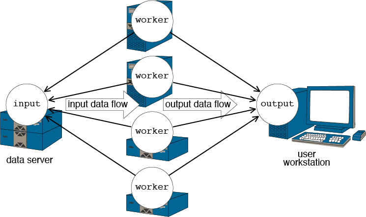
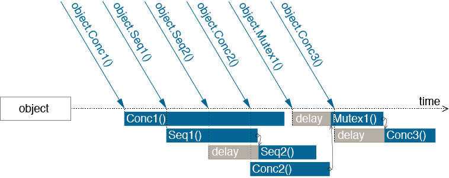

.. _popmodel:

Parallel Object Model
=====================

Introduction
------------

Object-oriented programming provides high level abstractions for software
engineering. In addition, the nature of objects makes them ideal structures to
distribute data and executable codes over heterogeneous distributed hardware
and to make them interact between each other. Nevertheless, two questions
remain:

* Question 1: which objects should run remotely?
* Question 2: where does each remote object live?

The answers, of course, depend on what these objects do and how they interact
with each other and with the outside world. In other words, we need to know the
communication and the computation requirements of objects. The parallel object
model presented in this chapter provides an object-oriented approach for
requirement-driven high performance applications in a distributed heterogeneous
environment.

Parallel Object Model
---------------------

POP stands for *Parallel Object Programming*, and POP parallel objects are
generalizations of traditional sequential objects. POP-Java is an extension of
Java that implements the POP model. POP-Java instantiates parallel objects
transparently and dynamically, assigning suitable resources to objects.
POP-Java also offers various mechanisms to specify different ways to do method
invocations. Parallel objects have all the properties of traditional objects
plus the following ones:

* Parallel objects are shareable. References to parallel objects can be passed
  to any other parallel object. This property is described in :ref:`shareable`.

* Syntactically, invocations on parallel objects are identical to invocations
  on traditional sequential objects. However, parallel objects support various
  method invocation semantics: synchronous or asynchronous, and sequential,
  mutex or concurrent. These semantics are explained in section
  :ref:`semantic`.

* Parallel objects can be located on remote resources in separate address
  spaces. Parallel objects allocations are transparent to the programmer. The
  object allocation is presented in section :ref:`allocation`.

* Each parallel object has the ability to dynamically describe its resource
  requirement during its lifetime. This feature is discussed in detail in
  section :ref:`requirement`.

As for traditional objects, parallel objects are active only when they execute
a method (non active object semantic). Therefore, communication between
parallel objects are realized thank to remote methods invocation.

.. _shareable:

Shareable Parallel Objects
--------------------------

Parallel objects are shareable. This means that the reference of a parallel
object can be shared by several other parallel objects. Sharing references of
parallel objects are useful in many cases. For example, :num:`fig-scenario`
illustrates a scenario of using shared parallel objects: ``input`` and
``output`` parallel objects are shareable among ``worker`` objects. A
``worker`` gets work units from ``input`` which is located on the data server,
performs the computation and stores the results in the ``output`` located at
the user workstation. The results from different ``worker`` objects can be
automatically synthesized and visualized inside ``output``.

.. _fig-scenario:

   A scenario using shared parallel objects

To share the reference of a parallel object, POP-Java allows parallel objects
to be arbitrarily passed from one place to another as arguments of method
invocations.

.. _semantic:

Invocations semantics
---------------------

Syntactically, method invocations on parallel objects are identical to those
on traditional sequential objects. However, to each method of a parallel
object, one can associate different invocation semantics. Invocation semantics
are specified by programmers when declaring methods of parallel objects. These
semantics define different behaviors for the execution of the method as
described below (example of syntax in :ref:`dev`):

* **Interface semantics**, the semantics that affect the caller of the method:

  * **Synchronous invocation**: the caller waits until the execution of the
    called method on the remote object is terminated. This corresponds to the
    traditional method invocation.
  * **Asynchronous invocation**: the invocation returns immediately after
    sending the request to the remote object. Asynchronous invocation is
    important to exploit the parallelism. However, as the caller does not wait
    the end of the execution of the called method, no computing result is
    available. This excludes asynchronous invocations from producing results.
    Results can be actively returned to the caller object using a callback to
    the caller. To do so the called object must have a reference to the caller
    object. This reference can be passed as an argument to the called method
    (see :num:`fig-inv-async`).

    .. _fig-inv-async:
    .. figure:: images/inv_async.png
       :width: 10cm

       Callback method returning values from an asynchronous call

* **Object-side semantics**, the semantics that affect the order of the
  execution of methods in the called parallel object:

  * **A mutex call** is executed after completion of all calls previously
    arrived.
  * **A sequential call** is executed after completion of all sequential and
    mutex calls previously arrived.
  * **A concurrent call** can be executed concurrently (time sharing) with
    other concurrent or sequential calls, except if mutex calls are pending or
    executing. In the latter case the call is executed after completion of all mutex
    calls previously arrived.

In a nutshell, different object-side invocation semantics can be expressed in
terms of atomicity and execution order. The mutex invocation semantics
guarantees the global order and the atomicity of all method calls. The
sequential invocation semantics guarantees only the execution order of
sequential methods. Concurrent invocation semantics guarantees neither the
order nor the atomicity.

.. _fig-inv-semantics:

   Example of different invocation requests

:num:`fig-inv-semantics` illustrates different method invocation semantics.
Sequential invocation ``Seq1()`` is served immediately, running concurrently
with ``Conc1()``. Although the sequential invocation ``Seq2()`` arrives before
the concurrent invocation ``Conc2()``, it is delayed due to the current
execution of ``Seq1()`` (no order between concurrent and sequential
invocations). When the mutex invocation ``Mutex1()`` arrives, it has to wait
for other running methods to finish. During this waiting, it also blocks other
invocation requests arriving afterward (``Conc3()``) until the mutex invocation
request completes its execution (atomicity and barrier).

.. _allocation:

Parallel Object Allocation
--------------------------

The first step to allocate a new object is the selection of an adequate
placeholder. The second step is the object creation itself. Similarly, when an
object is no longer in use, it must be destroyed in order to release the
resources it is occupying in its placeholder. The POP-C++ runtime system
provides automatic placeholder selection, object allocation, and object
destruction. Those automatic features result in a dynamic usage of computational
resources and gives to the applications the ability to adapt to the changes in
both the environment and the user behavior.

The creation of POP-Java parallel objects is driven by high-level requirements
on the resources where the object should lie (see section :ref:`requirement`).
If the programmer specifies these requirements they are taken into
consideration by the runtime system for the transparent  object allocation. The
allocation process consists of three phases: first, the system finds a suitable
resource, where the object will lie; then the object code is transmitted and
executed on that resource; and finally, the corresponding interface is created
and connected to the object.

.. _requirement:

Requirement-driven parallel objects
-----------------------------------

Parallel processing is increasingly being done using distributed systems, with
a strong tendency towards web and global computing. Efficiently extracting high
performance from highly heterogeneous and dynamic distributed environments is a
challenge today. POP-C++ and POP-Java were conceived under the belief that for
such environments, high performance can only be obtained if the two following
conditions are satisfied:

* The application should be able to adapt to the environment;
* The programming environment should somehow enable objects to describe their
  resource requirements.

The application adaptation to the environment can be fulfilled by multilevel
parallelism, dynamic utilization of resources or adaptive task size
partitioning. One solution is to dynamically create parallel objects on demand.

Resource requirements can be expressed by the quality of service that objects
require from the environment. Most of the systems offering quality of service
focus on low-level aspects, such as network bandwidth reservation or real-time
scheduling. Both POP-C++ and POP-Java integrate the programmer requirements
into parallel objects in the form of high-level resource descriptions. Each
parallel object is associated with an object description that depicts the
characteristics of the resources needed to execute the object. The resource
requirements in object descriptions are expressed in terms of:

* Resource (host) name (low level description, mainly used to develop system
  services).
* The maximum computing power that the object needs (expressed in MFlops).
* The maximum amount of memory that the parallel object consumes.
* The expected communication bandwidth and latency.
* The preferred communication protocol.
* The preferred encoding protocol.

An object description can contain several items. Each item corresponds to a
type of characteristics of the desired resource. The item is classified into
two types: strict item and non-strict item. A strict item means that the
designated requirement must be fully satisfied. If no satisfying resource is
available, the allocation of parallel object fails. Non-strict items, on the
other hand, give the system more freedom in selecting a resource. Resource that
partially match the requirements are acceptable although a full qualification
resource is  preferable. For example, a certain object has a preferred
performance 150MFlops although 100MFlops is acceptable (non-strict item), but
it needs memory storage of at least 128MB (strict item).

The construction of object descriptions occurs during the parallel object
creation. The programmer can provide an object description to each object
constructor. The object descriptions can be parametrized by the arguments of
the constructor. Object descriptions are used by the runtime system to select
an appropriate resource for the object. Some examples of the syntax of object
descriptions can be found in the section :ref:`dev-objdesc`.

It can occur that, due to some changes on the object data or some increase of
the computation demand, an object description needs to be re-adjusted during
the life time of the parallel object. If the new requirement exceeds some
threshold, the adjustment could cause the object migration. The current
implementations of POP-C++ and POP-Java do not support object migration yet.
