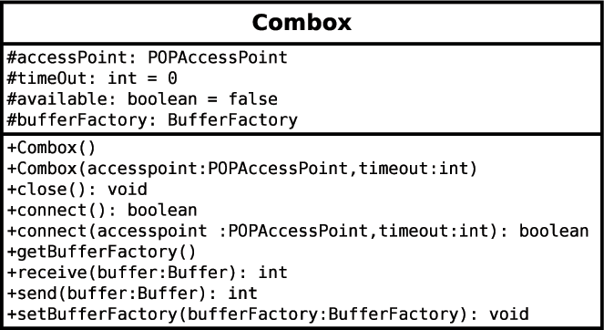
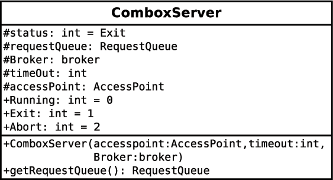
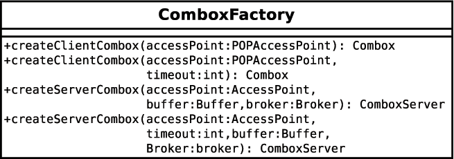
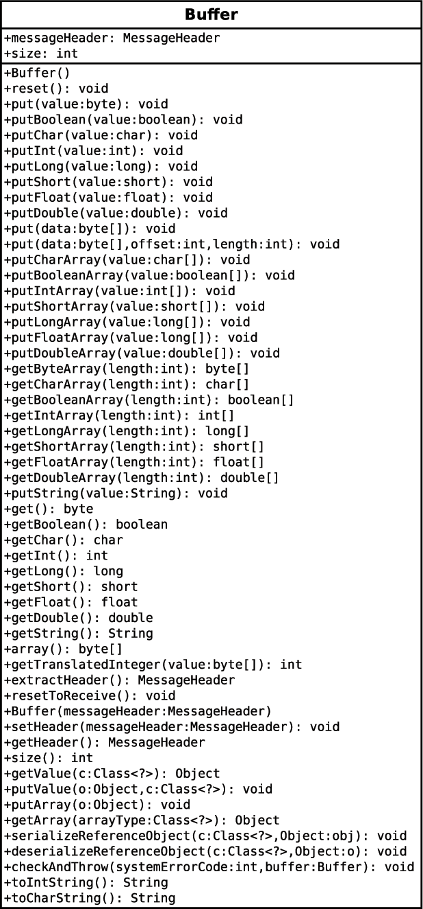
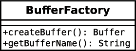

.. _plugin:

POP-Java plugin
===============

The POP-Java system can be augmented by its users. If the programmer feels the
need of a new network protocol or a new encoding protocol, he can create a
POP-Java plugin and add it to the system easily. This chapter aims to present
the combox and the buffer plugin systems.

Combox plugin
-------------

The Combox is the component responsible for the network communication between
an application and a parallel object or between two parallel objects. In the
current version of POP-Java, only the protocol socket is implemented. If the
programmer needs another protocol, he can create his own Combox.

To create a new protocol for POP-Java, the programmer needs to create three
different classes : a combox, a combox server and a combox factory.

The combox must inherits from the super class ComboxPlugin located in the
package ``popjava.combox`` in the POP-Java library. The
:num:`fig-combox-class` shows the ``ComboxPlugin`` class signature.

.. _fig-combox-class:

   ComboxPlugin class signature

The combox server must inherits from the super class ComboxServer located in
the package popjava.combox in the POP-Java library. The
:num:`fig-comboxserver-class` shows the ComboxServer class signature.

.. _fig-comboxserver-class:

   ComboxServer class signature

The combox factory must inherit from the super class ComboxFactory located in
the package ``popjava.combox`` in the POP-Java library. The
:num:`fig-comboxfactory-class` shows the ComboxFactory class signature.

.. _fig-comboxfactory-class:

   ComboxFactory signature

Once all the classes are implemented, the programmer needs to compile them as
standard Java code and create a JAR file. This JAR file can be added in the
system by editing the file ``pop_combox.xml`` located in the directory
``POPJAVA_LOCATION/plugin``. The XML code below is the current XML file with
the socket protocol.

.. code-block:: xml

   <ComboxFactoryList>
     <Package JarFile="popjava.combox.jar">
       <ComboxFactory>popjava.combox.ComboxSocketFactory</ComboxFactory>
     </Package>
   </ComboxFactoryList>

Buffer plugin
-------------

The buffer is the component in charge of the data encoding. In the current
implementation of POP-Java, two buffers are available. One is using the RAW
encoding and the other is using the XDR encoding. If the programmer needs a
special encoding protocol, he can also create his own and add it to the
POP-Java system as a plugin.

To implement a new encoding protocol, the programmer needs to create two class.
A buffer and a buffer factory.

The buffer must inherits from the super class BufferPlugin located in the
package ``popjava.buffer`` in the POP-Java library. The
:num:`fig-buffer-class` shows the ``BufferPlugin`` class signature.

.. _fig-buffer-class:

   BufferPlugin class signature

The buffer factory must inherit from the super class ``BufferFactory`` located
in the package ``popjava.buffer`` in the POP-Java library. The
:num:`fig-bufferfactory-class` shows the ``BufferFactory`` class signature.

.. _fig-bufferfactory-class:

   BufferFactory class signature
