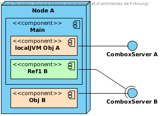
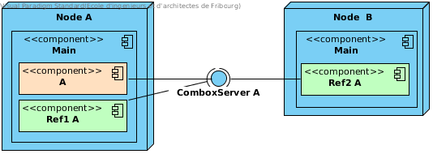

Advanced example
================

In this section, we detail a more complex example of a TFC use case. In this example, we don't have any default network and we publish only partially on the available networks.

We also introduce some advanced annotations such as ``@POPPrivate`` that can be used in more complex applications, and new parameters such as ``localhost``, ``tracking`` and ``localJVM``.

.. code-block:: java
	:emphasize-lines: 9,19,25

	@POPClass
	public static class A {

		private int n;

		public A() { }

		@POPObjectDescription(url = "localhost", protocols = "ssl",
			tracking = true, localJVM = true)
		public A(int n) {
			this.n = n;
		}

		@POPSyncSeq
		public int get() {
			return n;
		}

		@POPAsyncMutex(localhost = true)
		public void set(int n) {
			this.n = n;
		}

		@POPSyncSeq
		@POPPrivate
		public void divide() {
			n /= 2;
		}
	}

This class does the same as the one in the preceding example: it exposes a value to whoever wants to know it, except that now we have the possibility to modify the value even after the object creation. **However, this feature is not for everyone!**

Local JVM objects
-----------------

We can see in the ``@POPObjectDescription`` annotation that we have two new attributes: 

#. ``tracking``, which allows to know who used the object;
#. ``localJVM``, which allows to integrate the object in the current JVM instead of spawning a new one (see :num:`localjvm-ex`).

.. _localjvm-ex:

	Main create two POP objects: the first is a ``localJVM`` and the second a classic JVM.

Why creating an object this way? There are multiple reasons, the main one being that a POP object spawned locally does not require the data to be transmitted via a Combox and has access to all non-POP objects created in the JVM. This notably permits to make data accessed from a non-POP platform available to a POP application.

That said, this not an all in one solution: ``localJVM`` should be used with care! The annotations used to achieve synchronicity may not work (particularly ``async``), unless we treat the object as if it were remote.

.. code-block:: java

	A al = new A(10); // local JVM
	A ar = PopJava.getThis(al); // connect to the local JVM object

In the example above ``al`` is a ``localJVM`` object and is treated as such. ``ar`` also points to the same object ``al`` but must pass through a ``Combox`` to make calls. Thus, it also loses access to some methods.

Local special access method
---------------------------

``localJVM`` is generally used to make a hybrid application working with non-POP objects. Thus, some object methods might not be available for every connecting client but only for the JVM which created the object itself.

The ``@POPPrivate`` annotation is meant for keeping a method accessible to the JVM which created the object and not exposing it remotely.

.. code-block:: java

	// Node A
	A local = new A(10); // local JVM
	A ref1 = PopJava.getThis(local); // Connect to the local JVM object

	// Node B
	A ref2 = PopJava.connect(...) // Connect to nodeA -> local remotely

In the code above, we create a ``localJVM`` object and connect to it by creating a reference. Then we have a remote machine which is also connected to it. Figure :num:`localjvm-situation` shows the situation.

.. _localjvm-situation:

	Local JVM with local and remote connections

In this ``local`` example, we can call the method ``divide``; ``ref1`` and ``ref2`` do not have this method exposed because it is annotated with ``@POPPrivate``.

Remote special access method
----------------------------

``@POPPrivate`` is not the only restriction that we can make. The ``set`` method has an attribute in its annotation: ``localhost = true``. This attribute automatically checks that the calls to this method come from someone on the same machine than the object.

In the same preceding example, we can see that the ``set`` method is not accessible by everyone, but only by objects on Node A. Table below shows the access to the three methods of ``A``.

+------------+-------+-------+-------+
|   Method   | local | ref1  | ref2  |
+============+=======+=======+=======+
| **get**    |   ✔   |   ✔   |   ✔   |
+------------+-------+-------+-------+
| **set**    |   ✔   |   ✔   |   ✖   |
+------------+-------+-------+-------+
| **divide** |   ✔   |   ✖   |   ✖   |
+------------+-------+-------+-------+

Tracking
--------

Tracking allows to know how long an object was used and by who. Calls to a specific API with a POP object as a target permit to obtain this information.

Let's take the same example used in the two previous chapters: one object receives two connections from two different sources and is also used locally.

.. note:: It's important to know that we can not track the usage of a ``localJVM`` object, unless we are connected to it via a Combox. This means that we will never know how ``local`` uses A.

The person who created the POP object has access to its usage statistics. In fact, only the owner of the object knows all the users who used it.

The following information is usually extracted from a connecting user: the certificate (if present) used to identify the user,  the IP address and the network used for the connection.

.. note:: POP-Java does not handle the real identification of a user. It's the job of the one creating an application to provide this ability.

To access the statistics of a POP object we use the APIs provided by ``POPAccounting``. This class let us do principally 3 things:
	- See if an object has tracking enabled
	- Retrieve the users which used the object
	- Ask the stats for a given user
	- Ask the stats about the current connection

Own statistics
~~~~~~~~~~~~~~

Access your own statistics can be useful if you want to check how much you used another person shared object before closing a connection, usage is stacked and not connection independent. This means that if you connect two time to an object the the second time you request your statistics it will also contains the ones from the first connection.

.. code-block:: java

	POPTracking own = POPAccounting.getMyInformation(a);

``POPTracking`` contains the information the owner of the object will be able to see about yourself to identify you and your usage of the methods in the object.

Object statistics
~~~~~~~~~~~~~~~~~

If you are the owner of an object you are interested in knowing who used your object, for doing so you first need to request a user list to the object and successively ask detailed information on each of the user.

.. code-block:: java

	POPRemoteCaller[] users = POPAccounting.getUsers(a);
	for (POPRemoteCaller user : users) {
		POPTracking info = POPAccounting.getInformation(a, user);
		// do something
	}

Tracked information
~~~~~~~~~~~~~~~~~~~

We generally track three things the user did:
	- the method he used
	- how many times did he call said method
	- how long did the method execute for

With those information an owner of an object should be able to gather enough information to fill an invoice.
