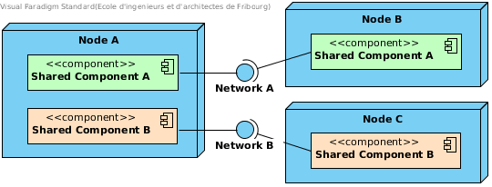

What is TFC
===========

TFC (Trusted Friend Computing) is object sharing model implemented in POP-Java which could be implemented in any context.

The model is based on the concept of objects and resources sharing without having to run any third party code on a given machine, but by having nodes in a network share a given program or module, see :num:`tfc-model`.

.. _tfc-model:

    Nodes sharing the same program/module

.. todo:: explain better