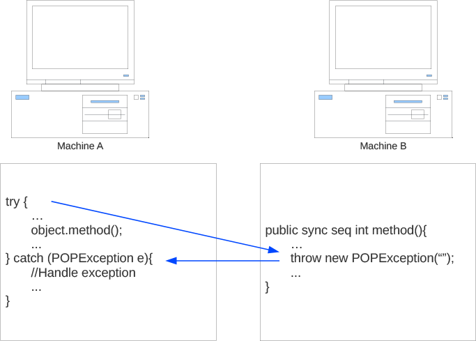

.. _dev:

Developing POP-Java applications
================================

The :ref:`POP model <popmodel>` is a suitable programming model for large
heterogeneous distributed environments but it should also remain as close as
possible to traditional object oriented programming. Parallel objects of the
POP model generalize sequential objects, keep the properties of object oriented
programming (data encapsulation, inheritance and polymorphism) and add new
properties.

The POP-Java language is an extension of Java that implements the POP model.
Its syntax remains as close as possible to standard Java so that Java
programmer can easily learn it and existing Java libraries can be parallelized
without much effort. Changing a sequential Java application into a distributed
parallel application is rather straightforward. POP-Java is also very close to
POP-C++ so that POP programmer can use both systems easily.

Parallel objects are created using parallel classes. Any object that
instantiates a parallel class is a parallel object and can be executed
remotely. To help the POP-C++ runtime to choose a remote machine to execute the
remote object, programmers can add object description information to each
constructor of the parallel object. In order to create parallel execution,
POP-Java offers new semantics for method invocations. These new semantics are
indicated thanks to new POP-Java keywords. This chapter describes the syntax of
the POP-Java programming language and presents the main tools available in the
POP-Java system.

Parallel objects
----------------

POP-Java parallel objects are a generalization of sequential objects. Unless
the term sequential object is explicitly specified, a parallel object is simply
referred as an object in the rest of this chapter.

Create a parallel class
~~~~~~~~~~~~~~~~~~~~~~~

Developing POP-Java application mainly consists of designing an implementing
parallel classes. The declaration of a parallel class is the same as a standard
Java class declaration, but it has to be annotated with the annotation 
``@POPClass``. The parallel class can extend another parallel class but not a
sequential class.

**Simple parallel class declaration**

.. code-block:: java

   @POPClass
   public class MyParallelClass {
      // Implementation
   }

**Parallel class declaration with an inheritance**

.. code-block:: java

   @POPClass
   public class MyParallelClass extends AnotherParallelClass {
      // Implementation
   }

As Java allows only single inheritance, a parallel class can only inherit
from **one** other parallel class. The Java language also imposes that the file
including the parallel class has the same name than the parallel class.

Parallel classes are very similar to standard Java classes. As POP-Java has
some different behavior, some restrictions applied to the parallel classes:

* All attributes in a parallel class must be protected or private
* The objects do not access any global variable
* A parallel class does not contain any static methods or non final static attributes

Creation and destruction
~~~~~~~~~~~~~~~~~~~~~~~~

The object creation process consists of several steps: locating a resource
satisfying the object description (resource discovery), transmitting and
executing the object code, establishing the communication, transmitting the
constructor arguments and finally invoking the corresponding object
constructor. Failures on the object creation will raise an exception to the
caller. :ref:`exception` will describe the POP-Java exception mechanism.

As a parallel object can be accessible concurrently from multiple distributed
locations (shared object), destroying a parallel object should be carried out
only if there is no other reference to the object. POP-Java manages parallel
objects' life time by an internal reference counter. A counter value of 0 will
cause the object to be physically destroyed.

Syntactically, the creation of a parallel object is identical to the one in
Java. A parallel object can be created by using the standard new operator of
Java.

Parallel class methods
~~~~~~~~~~~~~~~~~~~~~~

Like sequential classes, parallel classes contain methods and attributes.
Method can be public or private but attribute must be either protected or
private. For each public method, the programmer must define the invocation
semantics. These semantics, described in :ref:`semantic`, are specified by an
annotation.

* **Interface side**: These semantics affect the caller side.
  * ``sync``: Synchronous invocation.
  * ``async``: Asynchronous invocation.
* **Object side**: These semantics affect the order of incoming method calls on the object.
  * ``seq``: Sequential invocation
  * ``conc``: Concurrent invocation
  * ``mutex``: Mutual exclusive invocation

The combination of the interface and object-side semantics defines the overall
semantics of a method. There are 6 possible combinations of the interface and
object-side semantics, resulting in 6 annotations:

.. code-block:: java

   @POPSyncConc
   @POPSyncSeq
   @POPSyncMutex
   @POPAsyncConc
   @POPAsyncSeq
   @POPAsyncMutex

The following code example shows a synchronous concurrent method that returns an int value:

.. code-block:: java

   @POPSyncConc
   public int myMethod(){
      return myIntValue;
   }

A method declared as asynchronous must have its return type set to void.
Otherwise, the compiler will raise an error.

.. _dev-objdesc:

Object description
~~~~~~~~~~~~~~~~~~

Object descriptions are used to describe the resource requirements for the
execution of an object. Object descriptions are declared along with parallel
object constructor declarations. The object description can be declared in a
static way as an annotation of the constructor, or in a dynamic way as an
annotation on the parameters of the constructor. First an example of a static
annotation:

.. code-block:: java

   @POPObjectDescription(url="localhost")
   public MyObject(){
   }

and now a dynamic example:

.. code-block:: java

   public MyObject(@POPConfig(Type.URL) String host){
   }

Currently only the url annotation is implemented, allowing to specify the
URL/IP of the machine on which the POP-Object is executed. If the annotation is
not set, POP-Java will use the POP-C++ jobmanager to find a suitable machine.

Data marshaling and IPOPBase
~~~~~~~~~~~~~~~~~~~~~~~~~~~~

When calling a remote method, the arguments must be transferred to the object
being called (the same happens for the return value and the exception). In
order to operate with different memory spaces and different architectures, the data
is marshaled into a standard format prior to be sent to remote objects. All
data is serialized (marshaled) at the caller side an deserialized
(unmarshaled) at the remote side.

With POP-Java all primitive types, primitive type arrays and parallel classes
can be passed without any trouble to another parallel object. This mechanism is
transparent for the programmer.

If the programmer wants to pass a special object to or between parallel classes,
this object must implement the IPOPBase interface from the POP-Java library.
This library is located in the installation directory
(``POPJAVA_LOCATION/JarFile/popjava.jar``). By implementing this interface,
the programmer will have to override the two following methods:

.. code-block:: java

   @Override
   public boolean deserialize(Buffer buffer) {
      return true;
   }

   @Override
   public boolean serialize(Buffer buffer) {
      return true;
   }

These methods will be called by the POP-Java system when an argument of this
type needs to be serialized or deserialized. As the object will be reconstructed
on the other side and after the values will be set to it by the deserialize
method, any class implementing the ``IPOPBase`` interface must have a default
constructor.

The code below shows a full example of a class implementing the IPOPBase
interface:

.. code-block:: java
   :linenos:

   import popjava.buffer.Buffer;
   import popjava.dataswaper.IPOPBase;

   public class MyComplexType implements IPOPBase {
      private int theInt;
      private double theDouble;
      private int[] someInt;

      public MyComplexType(){}

      public MyComplexType(int i, double d, int[] ia){
         theInt = i;
         theDouble = d;
         someInt = ia;
      }

      @Override
      public boolean deserialize(Buffer buffer) {
         theInt = buffer.getInt();
         theDouble = buffer.getDouble();
         int size = buffer.getInt();
         someInt = buffer.getIntArray(size);
         return true;
      }

      @Override
      public boolean serialize(Buffer buffer) {
         buffer.putInt(is);
         buffer.putDouble(ds);
         buffer.putIntArray(ias);
         return true;
      }
   }

POP-Java behavior
-----------------

This section aims to explain the difference between the standard Java behavior
and the POP-Java behavior.

As in standard Java, the primitive types will not be affected by any
manipulation inside a method as they are passed by value and not by reference.
Objects passed as arguments tho methods will only be affected if the method semantic is “Synchronous”.
In fact, POP-Java serializes the method arguments to
pass them on the object-side. Once the method work is done, the arguments are
serialized once again to be sent back to the interface-side. If the method
semantic is “Synchronous”, the interface-side will deserialize the arguments
and replace the local ones by the deserialized arguments. If the method
semantic is “Asynchronous”, the interface-side will not wait for any answer
from the object-side. It's important to understand this small difference when
developing POP-Java application.

.. _exception:

Exception handling
------------------

Errors can be efficiently handled using exceptions. Instead of handling each
error separately based on an error code returned by a function call,
exceptions allow the programmer to filter and centrally manage errors through
several calling stacks. When an error is detected inside a certain method call,
the program can throw an exception that will be caught somewhere else.

The implementation of exception in non-distributed applications, where all
components run within the same memory address space is fairly simple. The
compiler just need to pass a pointer to the exception from the place where it
is thrown to the place where it is caught.  However, in distributed
environments where each component is executed in a separated memory address
space (and the data is represented differently due to heterogeneity),
the propagation of exception back to a remote component is complex.

.. _fig-exception:

   Exception handling example

POP-Java supports transparent exception propagation. Exceptions thrown in a
parallel object will be automatically propagated back to the remote caller
(:num:`fig-exception`). The current POP-Java version allows the following types
of exceptions:

* ``Exception``
* ``POPException``

The invocation semantics of POP-Java affect the propagation of exceptions. For
the moment, only synchronous methods can propagate the exception. Asynchronous
methods will not propagate any exception to the caller. POP-Java current
behavior is to abort the application execution when such an exception occurs.
