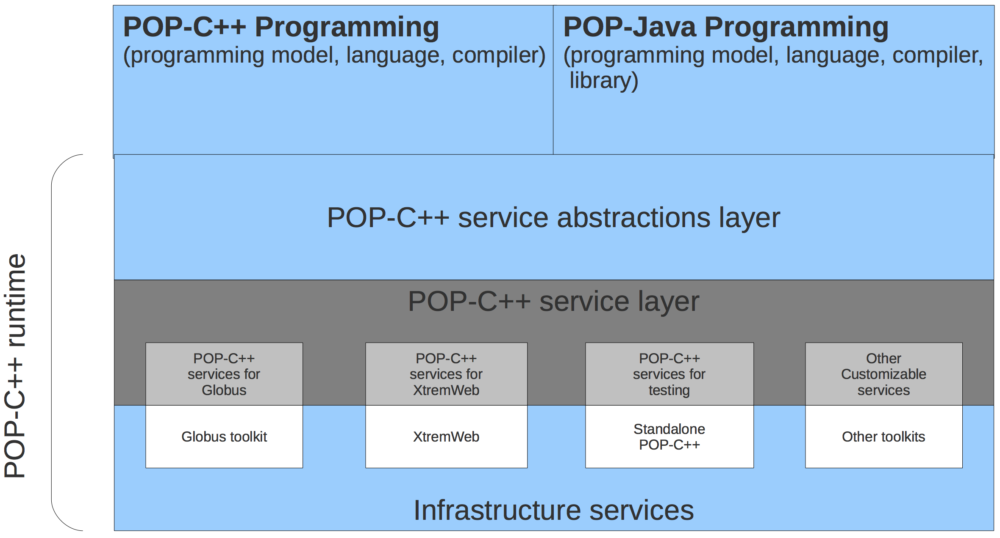

.. _intro:

Introduction and background
===========================

Introduction
------------

Programming large heterogeneous distributed environments such as GRID or P2P
infrastructures is a challenging task. This statement remains true even if
we consider research that has focused on enabling these types of
infrastructures for scientific computing such as resource management and
discovery :cite:`Foster97`, :cite:`Grimshaw99`, :cite:`Czajkowski98`, service
architecture :cite:`Foster02`, security :cite:`Welch03` and data management
:cite:`Allcock02`, :cite:`Stockinger01`. Efforts to port traditional
programming tools such as MPI :cite:`Foster98:2`, :cite:`Roy00`,
:cite:`Karonis03` or BSP :cite:`Tong03`, :cite:`Williams00`, also had some
success. These tools allow programmers to run their existing parallel
applications on large heterogeneous distributed environments. However,
efficient exploitation of performance regarding the heterogeneity still needs
to be manually controlled and tuned by programmers.

POP-C++ and POP-Java are implementations of the POP (**P**\ arallel
**O**\ bject **P**\ rograming) model first introduced by Dr. Tuan Anh Nguyen in
his PhD thesis :cite:`popc_thesis`. POP-C++ is an extension of the C++
programming language :cite:`Nguyen07` and POP-Java is an extension of the Java
programming language :cite:`popjava_tech`. The POP model is based on the very
simple idea that objects are suitable structures to distribute data and
executable codes over heterogeneous distributed hardware and to make them
interact between each other.

Inspired by CORBA :cite:`corba26` and C++, the POP-C++ programming language
extends C++ by adding a new type of **parallel object**, allowing to run C++
objects in distributed environments. With POP-C++, programming efficients
distributed applications is as simple as writing a C++ programs. The POP-Java
programming language extends Java and implements the same mechanisms as
POP-C++.

The POP model
-------------

The POP model extends the traditional object oriented programming model by
adding the minimum necessary functionality to allow for an easy development
of coarse grain distributed high performance applications.
When the object oriented paradigm has unified the concept of module and type to
create the new concept of **class**, the POP model unifies the concept
of class with the concept of **task** (or **process**). This
is realized by adding to traditional sequential classes a new type of class:
the **parallel class**. By instantiating parallel classes we are able
to create a new category of objects we will call **parallel objects**
in the rest of this document.

Parallel objects are objects that can be remotely executed. They coexist and
cooperate with traditional sequential objects during the application execution.
Parallel objects keep advantages of object-orientation such as data
encapsulation, inheritance and polymorphism and adds new properties to
objects such as:

* Distributed shareable objects
* Dynamic and transparent object allocation
* Various method invocation semantics

System overview
---------------

Although the POP-C++ programming system focuses on an object-oriented
programming model, it also includes a runtime system which provides the
necessary services to run POP-C++ and POP-Java applications over distributed
environments.

An overview of the POP system (Both POP-C++ and POP-Java) architecture is
illustrated in :num:`fig-popsystem`. In POP-Java, only the programming
system is implemented and the runtime system is the same as the one used in
POP-C++.

.. _fig-popsystem:

   POP system architecture

The POP-C++ runtime system consists of three layers: the service layer,
the POP-C++ service abstractions layer, and the programming layer. The
service layer is built to interface with lower level toolkits (e.g.
Globus) and the operating system. The essential service abstraction layer
provides an abstract interface for the programming layer. On top of the
architecture is the programming layer, which provides necessary support
for developing distributed object-oriented applications. More details of
the POP-C++ runtime layers are given in a separate document
:cite:`popc_thesis`.

Structure of this manual
------------------------

This manual has 8 chapters, including this introduction:

* :ref:`popmodel` explains the POP model.
* :ref:`dev` describes the POP-Java application development process.
* :ref:`compileandrun` explains the compilation and the launch process of a
  POP-Java application.
* :ref:`mixed` aims to describe and explain how to use of POP-C++ and POP-Java
  together in a same application.
* :ref:`plugin` describes the POP-Java plugin system.
* :ref:`install` guides the user trough the installation process.
* Finally, :ref:`trouble` gives some hints to solve the main problems that can
  occur with a POP-Java application.
